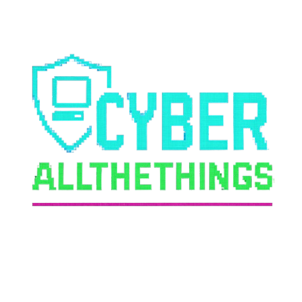

<p align="center">
  
</p>


## CyberAllTheThings: Red Team and Blue Team strategies</h1>

Overview
This project is a web-based platform designed to act as a centralized resource center for both Red Team (Offense) and Blue Team (Defense) cybersecurity professionals. The platform is divided into two major sections—Red Team and Blue Team—each offering guides, tools, and design resources tailored to their specific roles in cybersecurity operations.

## Purpose
The main goal of this project is to solve the issue of fragmented and scattered cybersecurity knowledge on the internet. By gathering essential materials into one organized web portal, the project serves:
- Cybersecurity professionals
- Students and educators
- Security researchers

## Features
- **Red Team Section**: Offensive security resources, penetration testing guides, exploitation tools.
- **Blue Team Section**: Defensive strategies, monitoring tools, incident response guides.
- **User-Friendly Design**: Clean UI with structured content for fast access to relevant material.
- **Learning-Oriented**: Useful for both self-teaching and formal coursework in cybersecurity.

## Benefits
- Promotes a holistic view of cybersecurity by combining offensive and defensive knowledge.
- Enhances skills in vulnerability scanning, threat analysis, and system hardening.
- Improves organizational decision-making and readiness through better resource access.

## Use Cases
- Security professionals can use the platform to stay updated and improve operational efficiency.
- Students and instructors can use it as part of a course module or for independent learning.
- Organizations can integrate the resources to support their internal cybersecurity strategies.

## Installation & Requirements

To run the platform locally, follow these steps:

```bash
# Clone the repository
git clone https://github.com/mrfa3i643/Graduation-project.git

# Navigate into the project directory
cd Graduation-project

# Install Flask (you can use a virtual environment if preferred)
pip install flask

# Run the application
python app.py
